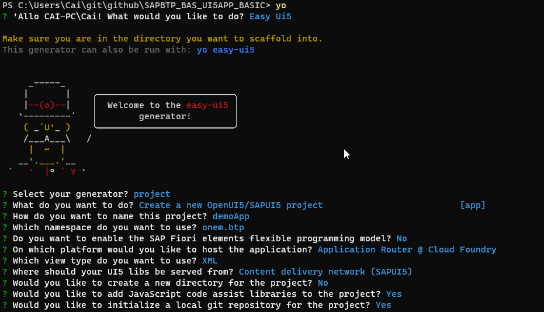

# demoApp

this APP shows how to create and deploy SAP UI5 app to SAP BTP cloud foundry runtime 

## prerequiste

1. Install the tool [CF](https://docs.cloudfoundry.org/cf-cli/install-go-cli.html)
2. Intall  the [MTA plugins](https://github.com/cloudfoundry/multiapps-cli-plugin#download-and-installation)
3. Install the [cloud MTA tool](https://sap.github.io/cloud-mta-build-tool/download/)
4. Install the [nodejs tool](http://nodejs.org/)  
5. Install the [VSC](https://code.visualstudio.com/)

## steps

1. This project has been generated with 💙 and [easy-ui5](https://github.com/SAP)
   
   

2. Deployment 
   
   ```
   npm run build:mta
   npm run deploy
   ```


## reference 

cp-sapui5-simple:  [https://developers.sap.com/tutorials/cp-cf-sapui5-local.html](https://developers.sap.com/tutorials/cp-cf-sapui5-local.html)

if we use custom-domain: [https://blogs.sap.com/2021/01/11/build-and-deploy-multitarget-applications-in-sap-cloud-platform-at-alibaba-cloud-using-the-cloud-foundry-command-line-interface/](https://blogs.sap.com/2021/01/11/build-and-deploy-multitarget-applications-in-sap-cloud-platform-at-alibaba-cloud-using-the-cloud-foundry-command-line-interface/)

